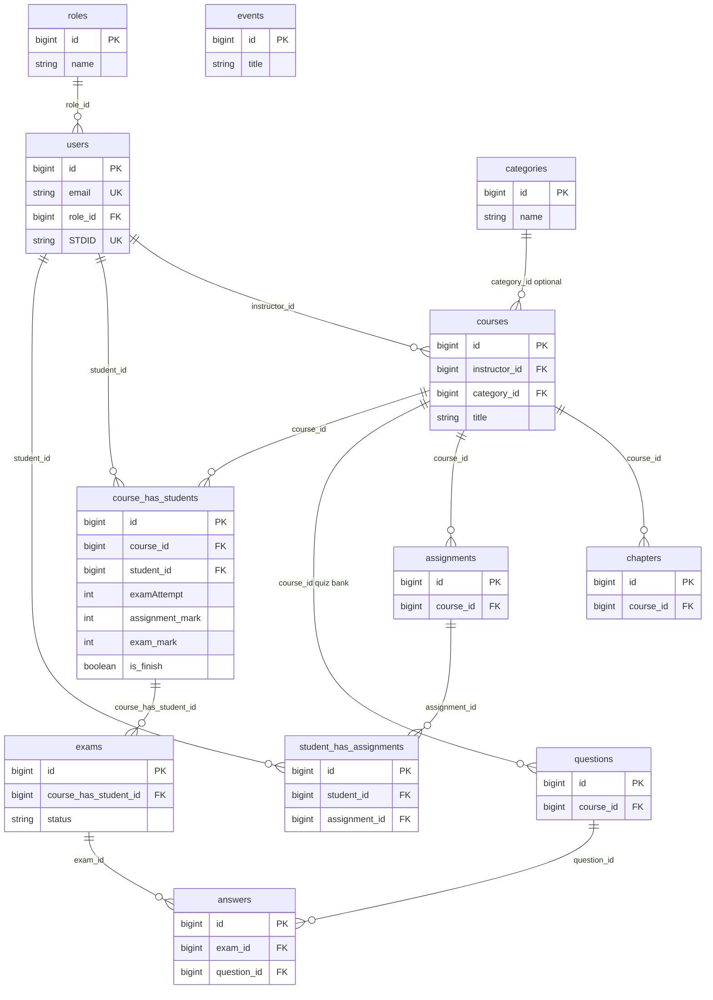

# i-lms-web

A small **Learning Management System (LMS)** built with Laravel. Think of it as a simplified version of platforms like Moodle or Canvas: instructors manage courses, students enroll and learn, and the app tracks exams and assignments.

This repo is meant to be **easy to read** if you are new to web development. The structure follows common Laravel patterns—controllers, models, Blade views, and migrations—so you can map what you learn in tutorials to **real-world-style** features (auth, roles, CRUD, and a dashboard).

---

## What you can do in this app

**As a visitor**

- Browse a welcome page, public **events**, and **courses**.

**As a logged-in student**

- Open a course, work through content, submit **assignments**, take **exams**, and see **results**.
- Update your **profile**.

**As an admin or instructor** (see *Roles* below)

- Use a **dashboard** to manage **users**, **events**, and **courses**.
- Organize courses with **categories**, **chapters** (including API-style routes used from the UI), **assignments**, and **quiz questions**.
- **Enroll** students in courses and review assignment submissions.

---

## Tech stack

| Layer        | Technology                                      |
| ------------ | ----------------------------------------------- |
| Backend      | PHP 8.2+, **Laravel 11**                        |
| Auth         | **Laravel Breeze** (login, registration, email verification) |
| Database     | **SQLite** by default (MySQL/PostgreSQL supported via Laravel config) |
| Frontend     | **Blade** templates, **Tailwind CSS**, **Alpine.js** |
| UI helpers   | **Flowbite**                                    |
| Assets       | **Vite**                                        |
| Code quality | **Laravel Pint** (PHP formatting), **PHPUnit**  |

---

## Database

The database is organized around **courses**. An **instructor** (`users`) owns each course. **Students** (also `users`) connect to courses through a **pivot** table, `course_has_students`, which stores enrollment and grades (assignment score, exam score, attempts, completion). That pattern is common in real apps: keep “who is in which class” and “their progress” on the join table, not duplicated on the course alone.

- **Chapters** and **assignments** and **questions** all belong to a **course** (one-to-many).
- **Exams** belong to one enrollment row (`course_has_students`), so each exam attempt is tied to “this student in this course.” **Answers** link an **exam** to a **question** and store what the student chose.
- **Student submissions** for file assignments use `student_has_assignments` (student + assignment + uploaded file).
- **Events** are standalone announcements (no foreign keys to courses).
- **`configs`** holds settings used when generating student/instructor IDs (prefix and counter)—not drawn in the diagram below.
- Laravel also creates **framework** tables (`sessions`, `cache`, `jobs`, …) when you use those drivers; they are not part of the LMS domain model.

The diagram matches `database/migrations`. On [GitHub](https://github.com) and many Markdown viewers, the Mermaid chart renders automatically.



**Reading the diagram:** a line like `courses ||--o{ chapters` means one course has many chapters. `||` and `o{` are standard ER “crow’s foot” notation in Mermaid (one side mandatory, many side optional from the parent’s perspective).

---

## Who this is for

- **Junior developers** who want to see how a full-stack PHP app is organized.
- Anyone comparing **clean, conventional Laravel** layout to smaller demo projects.

The codebase separates **public** routes, **student** areas, and **admin** routes (under `/dashboard` with role checks). That split is how many production apps keep permissions clear.

---

## Requirements

- PHP **8.2** or newer with common extensions (see [Laravel server requirements](https://laravel.com/docs/11.x/deployment#server-requirements))
- [Composer](https://getcomposer.org/)
- [Node.js](https://nodejs.org/) (LTS recommended) and npm

---

## Local setup

1. **Clone the repository** and open the project folder.

2. **Install PHP dependencies**

   ```bash
   composer install
   ```

3. **Environment file**

   ```bash
   cp .env.example .env
   php artisan key:generate
   ```

4. **Database**

   The example `.env` uses **SQLite**. Ensure the database file exists:

   ```bash
   touch database/database.sqlite
   ```

   Then run migrations and optional demo data:

   ```bash
   php artisan migrate
   php artisan db:seed
   ```

   Seeding creates roles, sample users, events, and courses. You can sign in as the seeded **admin** with:

   - **Email:** `admin@gmail.com`  
   - **Password:** `password`

   Other seeded users use random emails from Faker; the admin account is the reliable way to try the dashboard.

   To use MySQL or PostgreSQL instead, set `DB_*` variables in `.env` and run `php artisan migrate` again.

5. **Install frontend dependencies and run Vite**

   ```bash
   npm install
   npm run dev
   ```

   Keep this terminal open while developing so CSS and JavaScript rebuild on change.

6. **Start the Laravel server** (in another terminal)

   ```bash
   php artisan serve
   ```

   Open the URL shown (usually `http://127.0.0.1:8000`).

7. **Optional:** Register via the UI (student ID is generated from app config). New accounts may have **no role** until you set `role_id` on the `users` row or use seed data. For a quick tour of the **admin** dashboard, use the seeded `admin@gmail.com` account above.

---

## Useful commands

| Command              | Purpose                    |
| -------------------- | -------------------------- |
| `php artisan serve`  | Run the app locally        |
| `npm run dev`        | Vite dev server (assets)   |
| `npm run build`      | Production asset build     |
| `php artisan migrate`| Apply database migrations  |
| `./vendor/bin/pint`  | Format PHP (Laravel Pint)   |
| `php artisan test`   | Run automated tests        |

---

## Project layout (high level)

- `app/Http/Controllers/Admin/` — Dashboard: users, events, courses, chapters, assignments, questions.
- `app/Http/Controllers/Client/` — Student-facing: courses, exams, profile, welcome.
- `app/Models/` — Eloquent models (e.g. `Course`, `Chapter`, `Exam`, `User`).
- `resources/views/` — Blade templates for public pages and dashboards.
- `routes/web.php` — Main HTTP routes and middleware (auth, verified, role).

---

## License

This project inherits the **MIT** license from the Laravel application skeleton unless you add your own `LICENSE` file.

---

## Learning resources

- [Laravel 11 documentation](https://laravel.com/docs/11.x)
- [Laravel Breeze](https://laravel.com/docs/11.x/starter-kits#laravel-breeze)

If something in the UI does not update after you change Blade or CSS, run `npm run dev` or `npm run build` and refresh the browser.
